# 学习并复刻Lyra项目
## 🎬 演示视频
点击下图查看完整演示视频（B站）👇  

[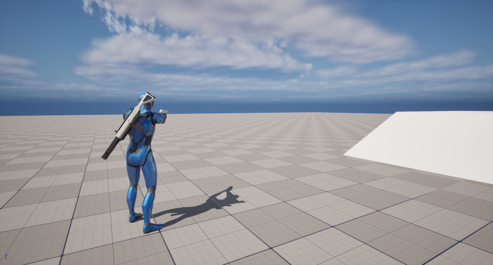](https://www.bilibili.com/video/BV1mWhHzNExQ)

# MyALS学习要点

## 整体要点：

- BP_Base负责计算各种状态之间的转换，继承Layer
  - 兼具画Debug的功能

- BP_Layer负责每个Layer具体的动画呈现，实现Layer
  - 使用Property Access读取BP_Base里计算好的数据

- BP_Unarmed、BP_Rifle、BP_Pistol是BP_Layer的子蓝图，用于设定不同的动画序列。

### Gate设置

- Gate是移动状态的意思：Jog, Walk等
- 使用Structure保存每个Gate需要设置的各种移动信息
- 人物蓝图中：瞄准时切换为Walk-Gate，非瞄准时为Jog-Gate状态
- 动画蓝图中调用BP_Base的接口，让BP_Base接受Gate状态
- BP_Layer中读取Property Access BP_Base中的Gate状态选择合适的动画序列播放

### Lean(施加到Cycle Layer上)设置：与旋转速率有关

- 三个Lean单帧动画序列中，设置Additive。需要深入研究原理。
- 创建BlendSpace 2D
  - H-Axis-Lean Angle，BP_Base中计算并保存
  - V-Axis-Gate
- BP_Layer中混合Blend Space 2D

### IDLE Break

为了防止所有的角色进行"环太平洋"（同步）的Idle动作

### Stop Animation：

- 核心：Distance Matching解决滑步问题
- 创建Cureve Compression settings资产，设置进Stop动画，改变其曲线压缩方式，从而获取Distance信息，从而实现Distance Matching。
- 新增专门的Stop Layer处理Stop Animation
- Distance Matching：
  - 根据加速度、最大速度、减速度、摩擦系数等在改变Gate时设置的那六个参数，计算开始减速到完全停下需要的距离。
  - 根据这段距离计算播放停止动画的起始时间，从而能让停止动画和实际的减速到停下的距离匹配。
  - 使用Sequence Evaluator才从Animation Sequence中间某个时间开始播放。
  - Advance Time 和 Distance Matching to Target
    - Advance Time 正常播放原动画，也就是变为了一个Sequence Player
    - Distance Matching to Target 根据停止距离播放动画
- Stride Warping 和 Distance Matching的区别：
  - 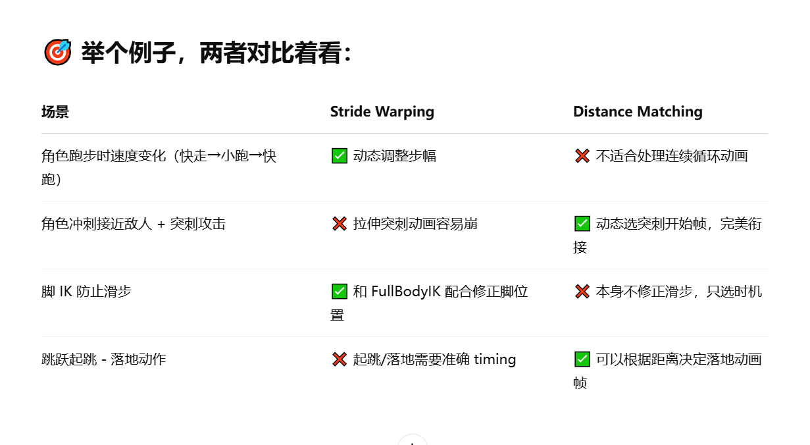

### Start Animation：

- 
- 遇到的问题，Max Transition Per Frame 设置为 1，使每一帧只计算一次转换条件。解决一开始按向右的时候，跳过Start直接到Cycle的情况。
- 使用Advance Time By Distance Matching 节点：来匹配角色实际走过的距离，和动画序列中走过的距离。

### Pivot Animatmion:

- 使用State Alias合并转换路径。
- 进入Pivot时机：使用点积计算 加速度 和 速度方向夹角，从而判断Pivot状态进入时机。
  - 点积为1，方向相反的时候才进入Pivot状态。
- Pivot -> Cycle：两个条件
  - Pivot动画播放完：使用Notify Satate
  - Pivot途中突然改变运动方向：即不按照原本Pivot的运动趋势进行运动，那么就直接终止Pivot而进行Cycle。
    - 保存进入Pivot动画时的加速度，以此代表Pivot动画的运动趋势

- Pivot Layer设计思路：
  - 创建两个State Machine
    - 转换条件

  - 根据加速度方向选择Pivot动画

- 存在的BUG
  - 现在Stop to Pivot之间还是有点问题，会突变，而不是丝滑的Blend
  - Pivot状态中，切换武器会重新播放Pivot动画，这样如果一直切换武器就会一直播放Pivot动画
    - 在Pivot到Cycle之间加一个传递条件，如果检测到Anim Layer是否发生了改变(即换了持枪状态)，则直接进入跑步状态。
    - 在Locomotion SM中的Start状态中添加StartLayerNode的Tag，然后在Locomotion SM的更新函数中，检查Anim Layer是否改变过。
    - 至于为什么只检查Start状态的Layer就行，是因为所有的状态都在同一个Layer里，随便检查一个就行。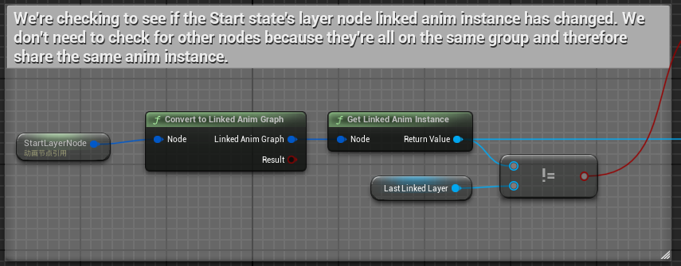

### Turn In Place

- Rotate root bone
- 因为只有Idle才能进入TurnInPlace，所以直接在IdleLayer中添加TurnInplace状态
- 让Mesh保持不动的原理：
  - Actor的旋转是跟随Controller的
  - 每一帧中，用当前Actor的世界旋转 减去 每一帧经历的旋转 得出Mesh应该旋转的偏移量，再设置Mesh为这个偏移量，从而让Mesh不跟随Actor旋转，始终在原地。
- 工作流程：
  - 随时更新RootYawOffset
  - Idle是Accumulate状态，其他是Blend Out状态
  - 给别的状态的Orientation Warping加上RootYawOffset，因为实际上Orientation Warping原理是根据 Mesh朝向 - 运动朝向，但是之前Mesh朝向和Camera朝向是相同的，所以之前都是用的Camera朝向。但是现在加上了YawOffset，则需要Camera朝向 - RootYawOffset才是Mesh朝向。
    - 公式：
    - Rv-(Rm=Rc)（之前）
    - Rv-(Rm=Rc+RootYawOffset) ➡️ Rv-Rc-RootYawOffset
  - 判断向左还是向右，转90还是180，并设置对应动画
  - 在Sequence evaluator的On Update方法中，一帧一帧的播放动画，即添加TurnInPlaceTime变量，每一帧增加DeltaTime时间，再设置此时间为Explicit Time，播放对应时间的帧动画
- 当前章节的BUG：
  - TurnInPlaceEntry ➡️ TurnInPlaceRecovery之间的过渡条件的Blend时间应该设置为0，因为播放的是同一个动画。否则会因为读取Curve延迟而在两个状态之间一直跳转，从而卡在这里。
  - 如果Aim Offset旋转的太快，会导致Spine过于扭曲，
    - 通过Clamp RootYawOffset来防止这种情况
    - 如图所说
  - TurnInPlaceRecovery ➡️ TurnInPlaceEntry之间的过度的Blend Logic应该设置为Inertialization，否则会导致抽搐，当Turn 180度的时候尤其明显
    - 原因如下：
    - 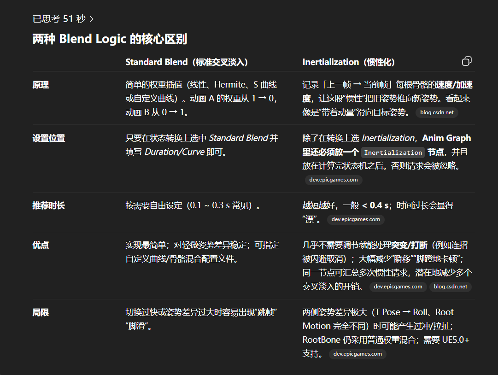
    - 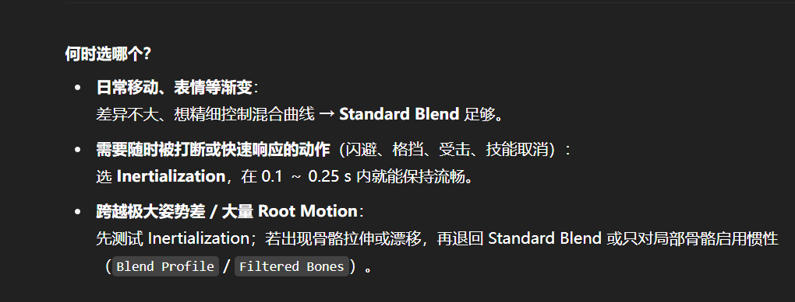

### Jump Animation

- 流程：Jump Start -> Jump Start Loop -> Jump Apex -> Jump Fall Loop -> Jump Fall Land -> Jump Recovery -> Idle/Cycle
- 主要技术：
  - Jump Apex：需要计算距离最高点的时间T，当T小于某个时间的时候开始播放Jump Apex动画
  - Jump Fall Land：需要使用计算距离地面的距离，然后使用Distance Match to Target从合适的地方播放Land动画。
  - Jump Fall Land Recovery：通过Additive，施加该Recovery动画到原动画。
    - 通过创建新的状态机实现，该状态机专门的Additive状态机，即专门输出用来Additive的动画。
    - 计算在空中下落的时间，来调整Blend的Alpha值，下落越久Alpha越大，混合的越多。

### Sync

- 添加Modifier：Sync....
- 自动根据添加的脚的位置的标记，匹配动画播放。
- 弄明白同步的原理

### Aim

- 所有的瞄准动画都based on AO CC动画帧，也就是说，所有的AO动画，都附加在AO CC动画帧上。
  - Additive aim type选 Mesh space(这个不同于Lean、Recovery选的Local Space)
- 使用AimOffset资产
  - 实际上也是Blend Space，Blend各个角度的姿势
- 使用Aim Offset Player节点，混合LocomotionSM状态机出来的动画

### Weapons

- 如果要Attach双手武器，必须骨骼里带Weapon骨骼才行，否则只能Attach单手武器
  - 需要问问GPT原因
- Attach component to component
  - Character SK mesh是Parent, 枪的SK mesh是Target
- 遇到的Bug：
- Bug1：确保左手保持在枪上与枪同步，需要以下节点
  - Hand IK Retargeting
  - Two bone ik
  - 创建Vitrual bone：Weapon_r 到 hand_l。
    - 目的：让左手不要有对齐延迟，而是迅速对齐。(复习的时候看不明白就去看视频198)
    - 原理：复制Virtrual bone的位移和旋转给ik_hand_l，让hand_l通过Two bone ik节点去对齐。
- Bug2：根据Equipped Gate，避免在Unarmed的时候还进行HandIK
  - 在Anim Graph中使用Blend Pose by bool节点，判断是否是Unarmed状态。

### Reload

- 使用节点Layer Blend Per Bone：
  - 使用Blend Mask模式，
  - 在骨骼资产中创建Blend Mask
  - Blend Mask可以详细设置每一根骨骼被混合的程度

## 需要看的节点

- Stride Warping
- Orientation Warping
  - 节点会自动通过奔跑动画的角色朝向 和 移动方向，与传进来的Locomotion Angle判断，是否需要扭曲。原理如下。
  - 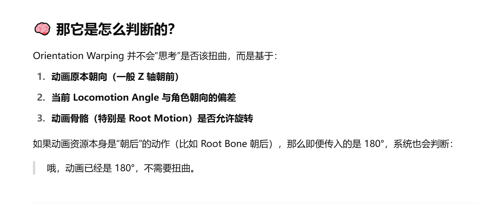

- Predict Ground Stop Location
- Advance Time By Distance Matching
  - 与Distance Match to Target的区别：
  - 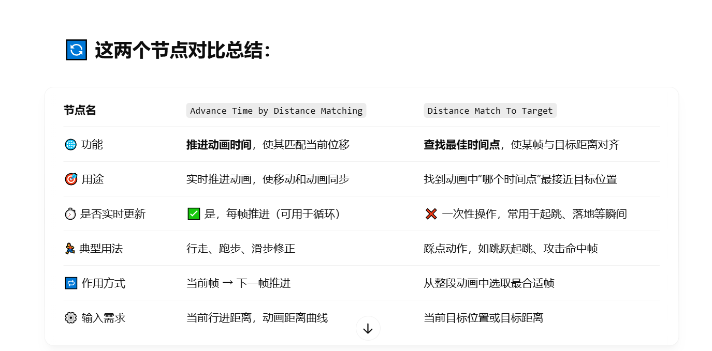
  - 虽然如此，但是Distance Match To Target也需要放在On Update方法中，从而每帧都根据剩余距离适时的挑选对应的帧播放。

## 需要弄懂的原理

- Stride Warping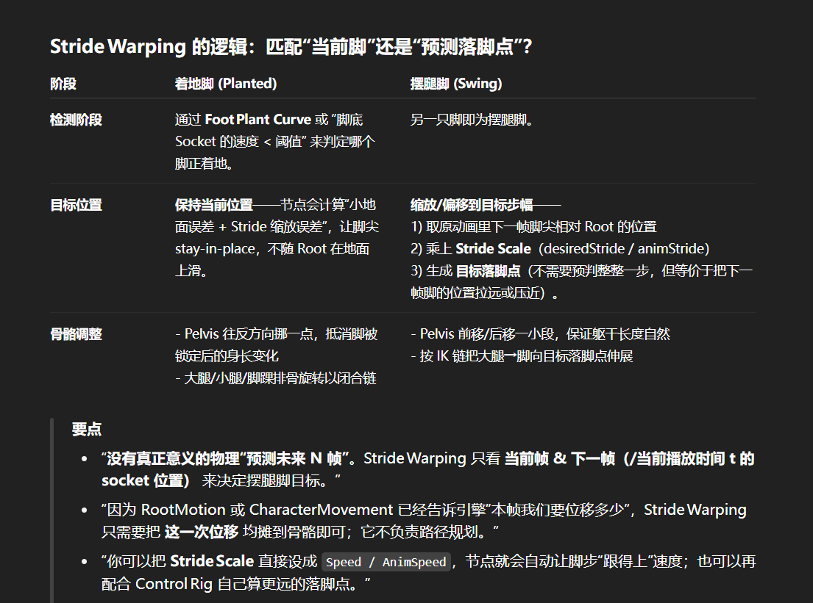
- 利用Additive施加Lean动画的原理。
- Blend Space的原理
- Sequence Evaluator里Advance Time 和 Set Explicit Time的区别
- 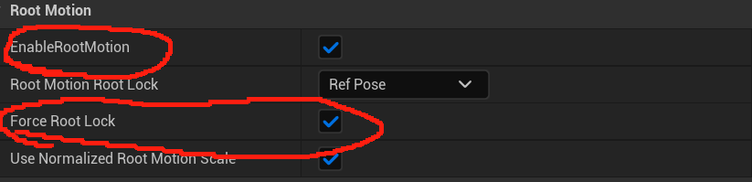
  - 这两个开关：
  - EnableRootMotion：是启用根运动，把根骨骼曲线信息给引擎读取并缓存
  - ForceRootLock：强制根骨骼停在原地，使动画中不会再移动，此时一般由其他代码控制角色移动。
- Hand IK Retargeting
- Two bone ik：最简单的Ik原理
- 为什么要勾选Enable Root Motion选项
  - 只是为了让引擎提取在该动画序列里与Root有关的位置/旋转信息，然后在用的的时候可以去拿。
  - 但是我们并不想让Root Motion动画驱动角色，所以我们锁上根骨骼的位置使其在Mesh空间不移动，同时在动画蓝图中设置Root Motion Mode为Ignore。
  - 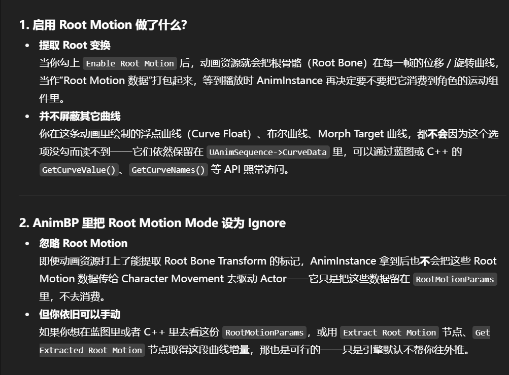

## 当前BUG

- JOG的时候按瞄准，这时候停下的减速度用的是Walk的，这会让人物滑行很大一段距离。
  - 已解决：增大Walk的减速度
- 斜向停下的时候播放Stop动画方向不对，且会滑步，但是还是效果不好。
  - 方向不对，已解决：添加Orientation Warping。
  - 滑步：目前没有好的解决办法，最好的还是增添加这四个斜向方向（左前左后右前右后）的动画。
- Start动画起步Freeze的现象
  - 解决办法(暂时)：设置State Mchine中的传递条件的Blend格式，改为Initialization, Blend Duration 改为0.25
  - 解决办法(完全)：Sync中解决
- Pivot减速阶段，取消减速，改为继续朝原方向加速，会一直卡到Pivot，知道Pivot播完才会进入Cycle动画，即：
  - 当按W跑，突然按S，进入Pivot阶段，在减速刹车阶段，又改为按W，此时人物不会立即又进入Cycle阶段，会卡在Pivot阶段。
  - 解决办法：修改Pivot中State重新计算的条件：
    - 加速度方向与速度方向相反 时重新计算Pivot
- 不同的顺序按方向键，因为有死区重叠，所以导致不同顺序按方向键，奔跑动作不一样
  - 更改判断逻辑
  - 不设置左右方向的死区
- Stop时，如果切换Layer，即切换武器的话，当前的减速速度使用的是上一个状态的，从而导致可能出现Stop动画不够而卡住的情况。
  - 出现原因：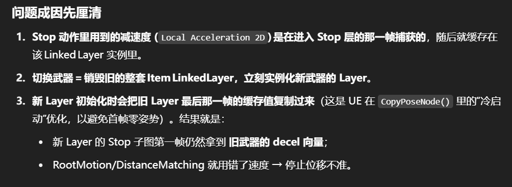
  - Lyra做的是，当切换Layer就从Stop切换为Idle状态，但是这样也会导致处在Idle状态平移。
